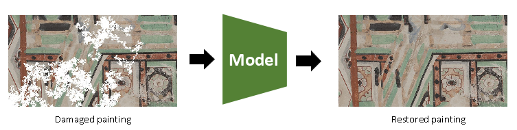
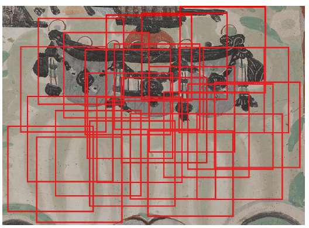
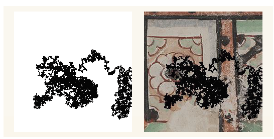
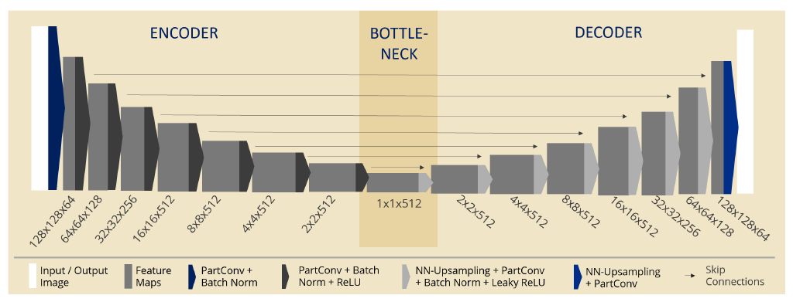
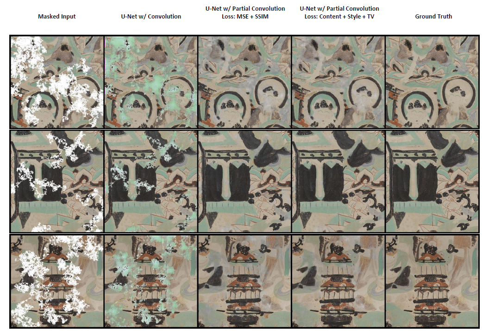

## Overview
Implementation of a partial convolution model for image inpainting:

## Data Pre-Processing
Limited size of the dataset was overcome by randomly sampling 25 sub-patches from each image:

Image masks were generated using a random walk model, and applied to the patches to effectively create a new dataset that was 25x larger:

## Model architecture
An autoencoder with partial convolution downsampling, skip connections, and nearest-neighbour upsampling was implemented. Content, style, and variation losses were used.

## Results:

